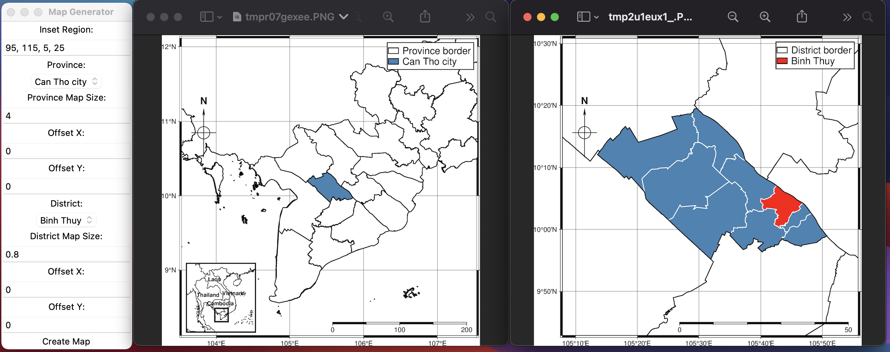

# VietnamMapPyGMY
Vẽ bản đồ tỉnh và huyện của Việt Nam với PyGMT


# Giao diện thực hiện tạo bản đồ

Chương trình này tạo ra một bản đồ của Việt Nam bằng PyGMT và cho phép người dùng tùy chỉnh bản đồ bằng cách chọn một tỉnh và một huyện cụ thể, điều chỉnh kích thước của tỉnh và huyện, và chọn một khu vực rộng hơn thêm vào góc dưới bên trái bản đồ. Bản đồ được hiển thị với 2 cửa sổ mới sau khi người dùng nhấp vào nút "Create Map".



## Cài đặt

Để sử dụng chương trình này, bạn cần phải cài đặt các thư viện Python sau:

- tkinter
- PIL (Python Imaging Library)
- pygmt
- geopandas

Bạn có thể cài đặt các thư viện này bằng pip:

```
pip install tkinter
pip install pillow
pip install pygmt
pip install geopandas
```

## Cách sử dụng

1. Chạy chương trình bằng cách thực thi tệp Python: `python3 MapGUI.py`
2. Nhập khu vực rộng hơn để thêm vào khóc dưới bên trái (đã có giá trị mặc định).
2. Chọn một tỉnh (hay thành phố) từ danh sách thả xuống.
3. Chọn một huyện (hay thị xã, thành phố) từ danh sách thả xuống.
4. Điều chỉnh kích thước của tỉnh và huyện (tùy chọn). Gia giảm kích thước và dịch chuyển mốc (offset) đối với các tỉnh có đảo ở xa để có kích thước phù hợp nhất,
6. Nhấp vào nút "Create Map".
7. Hai bản đồ tỉnh và huyện được tạo sẽ được hiển thị trong một cửa sổ mới. Đồng thời hai bản đồ dạng PDF cũng được tạo ra để chỉnh sửa thêm (Adobe Acrobat, Inkscape, Illustrator).

Lưu ý: Giá trị mặc định cho các trường đầu vào đã được thiết lập sẵn trong chương trình.

## Các file trong thư mục

- `MapGUI.py`: Tệp Python chính tạo ra bản đồ và tạo ra giao diện người dùng.
- `vnm_adm_gov_20201027`: Một thư mục chứa các tệp hình dạng cho các tỉnh và huyện của Việt Nam.
- `map_image1.png` và `map_image2.png` : Hai bản đồ dạng PNG
- `map_image1.pdf` và `map_image2.pdf` : Hai bản đồ dạng PDF

## Lưu ý

- Phần mềm được viết trong thời gia rất ngắn nên chưa tối ưu.
- Địa giới hành chính một số nơi có thể đã thay đổi so với bộ dữ liệu `vnm_adm_gov_20201027`

